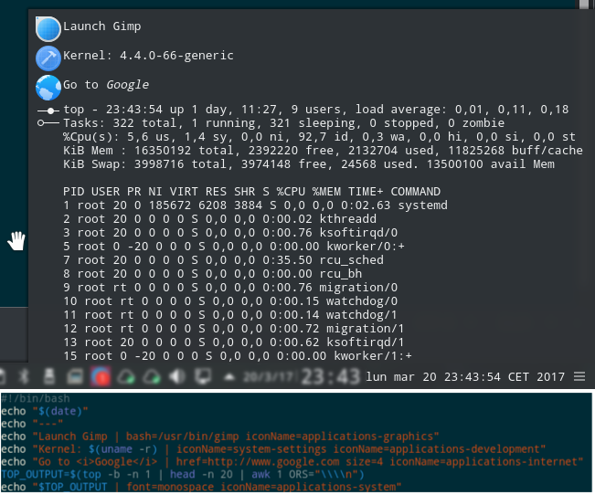
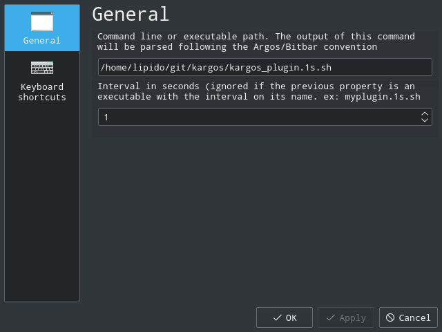
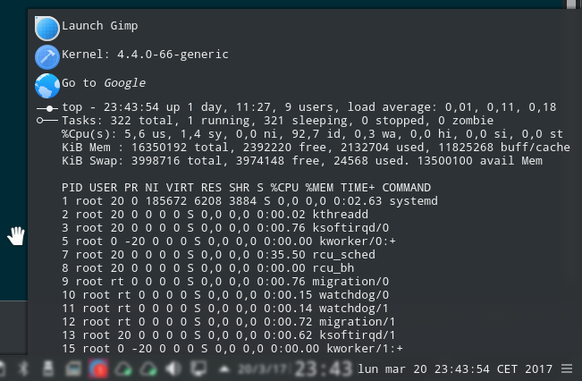

# kargos



A Plasma port of [Argos](https://github.com/p-e-w/argos/blob/master/README.md) and [BitBar plugins](https://github.com/matryer/bitbar-plugins) to fast create
custom plasmoids.

**Note: This is an alpha project. By now, it only was tested on Kubuntu 16.04 LTS.**

## What is implemented

- Submenus nesting ('--').
- "href" attribute.
- "bash" attribute.
- "size" attribute.
- "refresh" attribute.
- "iconName" attribute (it should be a valid KDE icon name)
- HTML support. Only the subset [supported by QML](http://doc.qt.io/qt-5/richtext-html-subset.html).
- Interval detection on the command filename. A custom interval option is available.

## Installation

To get and install the latest version:
```
git clone git@github.com:lipido/kargos.git
cd kargos
plasmapkg2 -t plasmoid --install .plasmoid
```

Also, you can find a release of kargos in [kde-look.org](https://store.kde.org/p/1173112/), 
so you can install it directly from your desktop by choosing "Get new widgets"

## Example plugin
kargos follows (part of) the [BitBar plugin](https://github.com/matryer/bitbar-plugins)
standard, which is very simple. To create a plugin, all you have to do is to create
an executable program (in any language) that produces standard output following
an [specific format](https://github.com/matryer/bitbar#plugin-api).

For example, this is the `kargos_plugin.1s.sh` file (1s means that the plasmoid will re-render
every 1 second):

```bash
#!/bin/bash
echo "$(date)"
echo "---"
echo "Launch Gimp | bash=/usr/bin/gimp iconName=applications-graphics"
echo "Kernel: $(uname -r) | iconName=system-settings iconName=applications-development"
echo "Go to <i>Google</i> | href=http://www.google.com size=4 iconName=applications-internet" 
TOP_OUTPUT=$(top -b -n 1 | head -n 20 | awk 1 ORS="\\\\n")
echo "$TOP_OUTPUT | font=monospace iconName=applications-system"
```

You need to configure this file in your plasmoid options:



And then it will produce the following contents in your plasmoid:


That's all. You can add the a kargo plasmoid to your panel. You have to configure 
it to indicate the command or executable.

