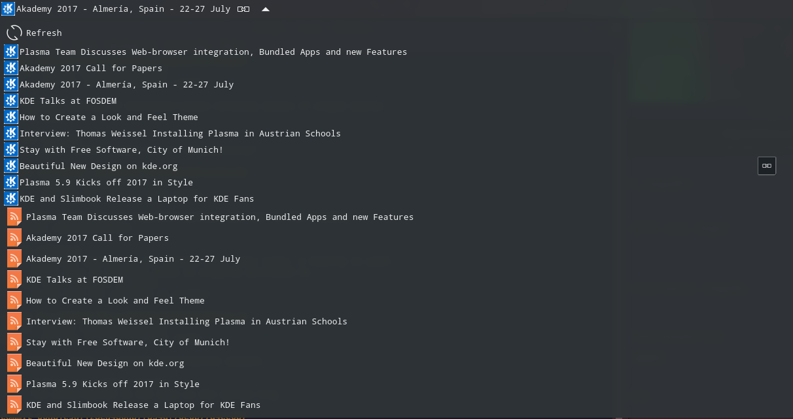

# kargos


A Plasma port of [Argos](https://github.com/p-e-w/argos/blob/master/README.md) and [BitBar plugins](https://github.com/matryer/bitbar-plugins) to fast create
custom plasmoids.

**Note: This is an alpha project. By now, it only was tested on Kubuntu 16.04 LTS.**

## What is implemented

- Submenus nesting ('--').
- "href" attribute.
- "bash" attribute.
- "size" attribute.
- "refresh" attribute.
- "iconName" attribute (it should be a valid KDE icon name)
- "font" attribute.
- "dropdown" attribute.
- "image" attribute (base64 encoded image).
- "imageURL" attribute (**non BitBar, kargos only**). A URL for the image.
- "imageWidth", "imageHeight" attributes (**non BitBar, kargos only**). Max size for
  the image. If only one is provided, aspect ratio is preserved.
- "terminal" attribute.
- "onclick" attribute (**non BitBar, kargos only**). Possible values: `bash` or `href`. What to execute if you click on the line, that is,
  to run the command indicated in the `bash` attribute or go to the web indicated by the `href` attribute. The corresponding "Go" or "Run"
  button will not appear.
- HTML support. Only the subset [supported by QML](http://doc.qt.io/qt-5/richtext-html-subset.html).
- Interval detection on the command filename. A custom interval option is available.

## Installation

To get and install the latest version:
```
git clone git@github.com:lipido/kargos.git
cd kargos
plasmapkg2 -t plasmoid --install .plasmoid
```

Also, you can find a release of kargos in [kde-look.org](https://store.kde.org/p/1173112/), 
so you can install it directly from your desktop by choosing "Get new widgets"

## Example plugin
kargos follows (part of) the [BitBar plugin](https://github.com/matryer/bitbar-plugins)
standard, which is very simple. To create a plugin, all you have to do is to create
an executable program (in any language) that produces standard output following
an [specific format](https://github.com/matryer/bitbar#plugin-api).

For example, this is the `examples/kargos_plugin.1s.sh` file (1s means that the plasmoid will re-render
every 1 second):

```bash
#!/bin/bash
echo "$(date)"
echo "---"
echo "Launch Gimp | bash=/usr/bin/gimp iconName=applications-graphics"
echo "Kernel: $(uname -r) | iconName=system-settings iconName=applications-development"
echo "Go to <i>Google</i> | href=http://www.google.com size=4 iconName=applications-internet" 
TOP_OUTPUT=$(top -b -n 1 | head -n 20 | awk 1 ORS="\\\\n")
echo "$TOP_OUTPUT | font=monospace iconName=applications-system"
```

You need to configure this file in your plasmoid options:


And then it will produce the following contents in your plasmoid:


That's all. You can add the a kargo plasmoid to your panel. You have to configure 
it to indicate the command or executable.

## Another example: a RSS reader
This a tribute to the KDE 3 KNewsTicker. There are many RSS readers, but the
concept of KNewsTicker was unique for me. I do not like to open a RSS client
or take any action to read feeds because, although I can do this the first days,
in a few days I am not checking them anymore. However, with KNewsTicker, news are
rotating continuously and in a discrete fashion. However, you will be aware of them
sooner or later.

KNewsTicker was discontinued and no longer available since KDE 4. But you can
implement it easily with kargos and Python!

You can find an [example](examples/rssnews.30m.py) of plugin to read your 
favourite RSS feeds. News will be rotating in your panel and, if you dropdown,
you can read all the news.

Here are the results!



